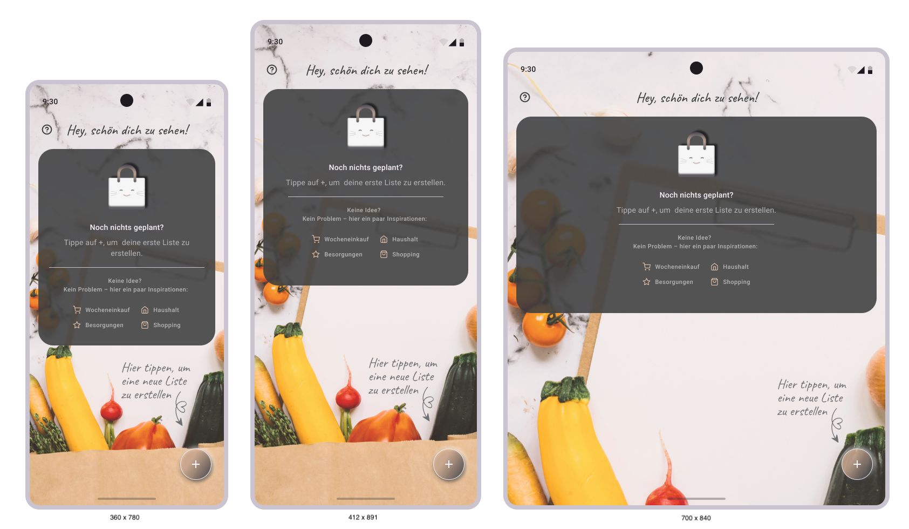

# Shopping List App
Weiterentwicklung einer bestehenden Einkaufslisten-Webanwendung durch ein neues UX/UI-Konzept und mobile App-Umsetzung

## Überblick
Die bestehende Webanwendung wurde ursprünglich mit React und UnoCSS entwickelt, basierte jedoch nicht auf einem strukturierten UX-Konzept. Ziel des Projekts war die Entwicklung eines konsistenten Mobile- und UI/UX-Konzepts sowie die Umsetzung einer App mit Flutter.

## Problem
Die bestehende Webanwendung wurde primär technisch umgesetzt, jedoch ohne ausgearbeitetes UX/UI-Konzept. Dadurch bestanden Potenziale zur Verbesserung von Nutzerführung, Konsistenz und mobiler Bedienbarkeit.

- Vorherige Version der Anwendung:
einkaufsliste-app.vercel.app

## Ziel
Entwicklung eines nutzerzentrierten UI/UX-Konzepts mit optimierter Informationsstruktur, klaren Interaktionen und moderner Mobile UX.

## Design Fokus 
Das Redesign fokussiert sich insbesondere auf:
- klare Interaktionsmuster
- bessere mobile UX
- konsistente UI-Komponenten
- reduzierte visuelle Komplexität

## Technologien
React · TypeScript · Capacitor · Figma · Flutter · Dart

## Meine Rolle
UI/UX Design · Redesign · Prototyping · Frontend- & Mobile-Entwicklung

## Prozess
- Analyse der bestehenden Webanwendung
- Identifikation von UX- und Strukturproblemen
- Entwicklung neuer User Flows und Mobile-Layouts in Figma
- Aufbau eines konsistenten Material 3 UI-Konzepts
- Umsetzung der App mit Flutter/Dart

## Lösung
- Neustrukturierte Start- und Listenansichten
- Verbesserte mobile Nutzerführung
- Swipe-Interaktionen für schnellere Bedienung
- Konsistente UI-Komponenten auf Basis von Material 3

# Moodboard 
Das Moodboard übersetzt Ideen und Inspirationen in eine visuelle Sprache.
Durch die Kombination von Farben, Texturen, Formen und Bildern entsteht eine klare Stimmung, die den Charakter des Projekts vermittelt und den kreativen Entwicklungsprozess leitet.

  

# Design Screens (Neuestes Update! Sept.2026)

## Ausgangsbasis der Prototypenentwicklung

                         
                                Für die Entwicklung des Prototyps wurde eine Viewport-Größe von 360 × 780 px als
                                Ausgangspunkt definiert.
                                Dies entspricht bei einer dreifachen Pixeldichte einer physischen Auflösung von 1080 ×
                                2340 Pixeln und orientiert sich damit beispielsweise an der Displayauflösung des Samsung
                                Galaxy S25. 

                                Das Interface wurde responsiv konzipiert, sodass sich die Darstellung flexibel an
                                unterschiedliche Bildschirmgrößen und Auflösungen anpassen lässt. Die responsive
                                Darstellung wurde beispielhaft mit folgenden Viewport-Größen getestet: 

                            <ul class="list-unstyled d-flex flex-column align-items-center ">
                                <li class="badgestyle"> 360 x 780 - Smartphone </li>
                                <li class="badgestyle"> 412 x 891 - großes Smartphone </li>
                                <li class="badgestyle"> 700 x 840 - Tablet / Large Screen</li>
                            </ul>

                            Die Abmessungen der Systemleiste sowie der Bildschirmtastatur wurden für den Prototyp
                            beispielhaft angenommen bzw. an Material-Design-Komponenten orientiert.
                            Die tatsächliche Darstellung und Größe dieser Systemelemente kann je nach
                            Betriebssystem, Gerät und Systemeinstellungen variieren.

                            

                     
- Neues UI/UX Konzept mit Material 3 Design Kit Komponenten: 

## Startseite (Liste leer)
 - Klare Einstiegsansicht zur schnellen Erstellung neuer Einkaufslisten.
 - Über den Aktionsbutton unten rechts lässt sich mit nur wenigen Klicks eine neue Liste anlegen:
   - nach dem Öffnen des Popup-Fensters wird der gewünschte Listenname eingegeben und bestätigt
   - die neue Einkaufsliste wird sofort erstellt und in der Übersicht angezeigt.
 - Zusätzlich unterstützt ein integrierter Hilfebutton neue Nutzer bei der Bedienung der Anwendung.

Der Fokus liegt auf einer intuitiven Bedienung, einer schnellen Navigation sowie einem modernen und benutzerfreundlichen Workflow.

## Listenübersicht (Startseite)
- In der Listenübersicht werden alle erstellten Einkaufslisten zentral angezeigt.
- Über die integrierte Suchleiste lassen sich Listen schnell und einfach durchsuchen.
- Zusätzlich bietet die Menüleiste die Möglichkeit, sämtliche Listen mit wenigen Klicks zu löschen.

## Neue Liste hinzufügen (Startseite)
- Über den Floating-Action-Button unten rechts kann schnell eine neue Einkaufsliste erstellt werden.
- Nach dem Klick öffnet sich ein Popup, in dem der Name der Liste eingegeben wird.
- Nach der Bestätigung wird die neue Liste automatisch erstellt und in der Listenübersicht angezeigt.

## Listen löschen (Startseite)
- Über die Menüoption „Alles löschen“ können sämtliche erstellten Listen mit einem einzigen Schritt vollständig entfernt werden.
- Einzelne Listen lassen sich zusätzlich durch eine Swipe-Geste nach links löschen.
  - Nach dem Löschen erscheint eine Snackbar mit der Option „Rückgängig“, sodass der Vorgang bei Bedarf sofort wieder rückgängig gemacht werden kann.

## Listenansicht
- In der Listenansicht werden die Inhalte einer ausgewählten Einkaufsliste übersichtlich dargestellt.
- Neue Einträge können unkompliziert über ein Textfeld hinzugefügt werden.
- Bereits bearbeitete Artikel können per Checkbox als abgeschlossen markiert werden.

- Die Einträge werden automatisch in die Bereiche „Offen“ und „Erledigt“ gruppiert.
- Beide Bereiche lassen sich ein- und ausklappen. 
- Dadurch bleiben erledigte Inhalte weiterhin erhalten, ohne bei umfangreichen Listen unnötig viel Platz einzunehmen oder die Übersichtlichkeit zu beeinträchtigen.

## Neue Listenelemente erstellen  
- Innerhalb einer geöffneten Einkaufsliste können neue Listenelemente schnell und einfach hinzugefügt werden.
- Der gewünschte Artikel wird in das Eingabefeld eingetragen und anschließend entweder durch Drücken der Enter-Taste oder über das Einkaufswagen-Symbol zur Liste hinzugefügt.
- Nach dem erfolgreichen Hinzufügen wird eine Snackbar angezeigt, die den Nutzer über das erfolgreiche Hinzufügen des Elements informiert.

## Listenelemente löschen 
- Einzelne Listenelemente können entweder durch eine Swipe-Geste nach links oder über eine Menüoption entfernt werden.
- Die Bedienung ist intuitiv gestaltet und ermöglicht ein schnelles Bearbeiten der Inhalte direkt innerhalb der Listenansicht.

## Listenelemente sortieren 
Die Listenelemente innerhalb einer Einkaufsliste können flexibel sortiert werden.

### Zur Verfügung stehen:

#### 1. Sortierung nach Titel

- Original
   - Neue Einträge werden standardmäßig am Ende der Liste hinzugefügt.
   - Abgehakte Elemente werden automatisch in einen separaten unteren Bereich verschoben.
   - Die Reihenfolge der übrigen Elemente bleibt unverändert.

- A–Z (aufsteigend)
   - Die Liste wird alphabetisch von A bis Z sortiert.
   - Neue Elemente werden automatisch an der korrekten alphabetischen Position eingefügt.

- Z–A (absteigend)
   - Die Liste wird alphabetisch von Z bis A sortiert.
   - Neue Elemente werden automatisch entsprechend der absteigenden Reihenfolge einsortiert.

#### 2. Sortierung nach Datum

- Neu-Alt
   - Die Liste wird nach Erstell- bzw. Hinzufügedatum sortiert, beginnend mit den neuesten Einträgen.
   - Neue Elemente erscheinen automatisch am Anfang der Liste.

- Alt-Neu
   - Die Liste wird nach Erstell- bzw. Hinzufügedatum sortiert, beginnend mit den ältesten Einträgen.
   - Neue Elemente werden automatisch am Ende der Liste einsortiert, wobei abgehakte Elemente weiterhin berücksichtigt bzw. nach unten verschoben werden können.

Dadurch lässt sich die Darstellung der Einträge individuell anpassen und sorgt für eine bessere Übersicht sowie eine strukturierte Verwaltung der Inhalte.

## Menübar Funktion (Alle Listenelemente löschen)
- Eine zentrale Funktion ist das vollständige Löschen aller Einträge innerhalb einer Liste.
- Dabei werden alle Listenelemente mit einem einzigen Schritt entfernt, ohne die Liste selbst zu löschen.
- Nach der Ausführung erscheint eine Snackbar, die den Nutzer darüber informiert, dass alle Inhalte erfolgreich gelöscht wurden.
-  Dadurch wird eine klare Rückmeldung über die durchgeführte Aktion sichergestellt und die Bedienung bleibt nachvollziehbar und transparent.

## Tageszeitabhängiges Greeting (Feature)
- Die App nutzt ein dynamisches Greeting-System, das sich an der aktuellen Tageszeit orientiert. 
- Diese kleine Interaktion verbessert die emotionale Wahrnehmung der Anwendung und sorgt für einen freundlichen ersten Eindruck.  
- Je nach Uhrzeit wird ein passender Begrüßungstext angezeigt:  
  - Guten Morgen von 05:00 - 09:59
  - Schönen Tag von 10:00 - 16:59
  - Guten Abend von 17:00 - 21:59
  - So spät noch wach? von 22:00 - 04:59 

# Wichtige Erkenntnisse
Die Überarbeitung eines bestehenden Produkts zeigte, wie stark ein strukturiertes UX-Konzept die Verständlichkeit, Konsistenz und mobile Nutzbarkeit verbessern kann.

# Hinweis
Weitere Screens und UI-Konzepte befinden sich im Ordner ui-ux-concept.

# Mögliche Erweiterungen

Die Anwendung ist modular aufgebaut und lässt sich flexibel um weitere Funktionen erweitern. Eine mögliche Erweiterung ist eine eigene Navigation Bar, über die unterschiedliche Bereiche der App direkt erreichbar sind.

Zukünftig könnten neben Einkaufslisten auch weitere Funktionen integriert werden, wie beispielsweise eine To-do-Liste oder ein Notizbereich. Dadurch würde die Anwendung über den reinen Einkaufslisten-Use-Case hinausgehen und zu einem vielseitigen Organisations-Tool weiterentwickelt werden.
